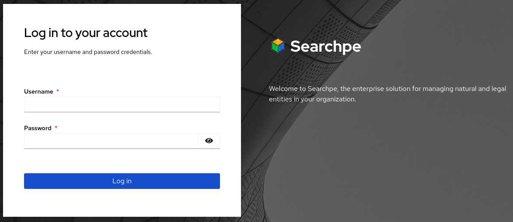

Ingresa a Searchpe a travéz de:

https://[[HOST_SUBDOMAIN]]-8180-[[KATACODA_HOST]].environments.katacoda.com

## Crear usuario primario

Al ser la primera vez que ingresas a Searchpe, tendrás que crear un usuario y sus credenciales. Para este ejemplo utiliza:

- Username = `admin`
- password = `password`

## Login

Una vez creado tu usuario primario puedes hacer login en Searchpe.

