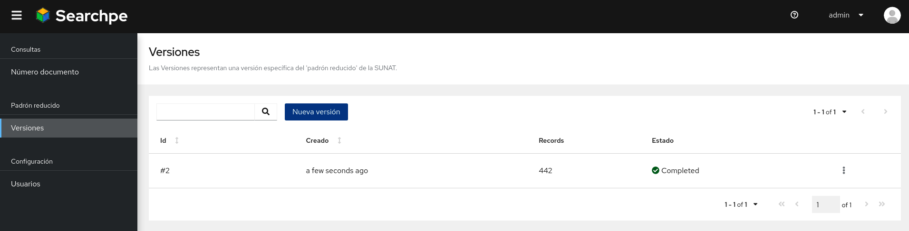

Crea una nueva versión del padrón reducido haciendo clien en:

**Versiones > Nueva versión**

Deberás de ver el siguiente resultado:



## Consulta `Número de documento` usando la UI

Ingresa al menu `Número de documento` y, utilizando el buscador de la interface, busca por los siguientes Números de documento:

- 20330791412 (RUC)
- 45215942 (DNI)
- 10452159428 (RUC)

> Recuerda que en este laboratorio no estamos haciendo uso del `padrón reducido` completo sino solo de una versión reducida de prueba. Puedes ver el contenido del padrón de prueba en [Padrón reducido prueba](https://raw.githubusercontent.com/project-openubl/searchpe/master/src/test/resources/padron_reducido_ruc.zip)

## Consulta `Número de documento` usando el terminal

### Usa la opción `-u` para credenciales

- Usa el comando `curl`:

```
curl -u admin:password http://localhost:8180/api/contribuyentes/10452159428
```

- Usa `json_pp` para hacer el JSON amigable para los humanos:

```
curl -u admin:password http://localhost:8180/api/contribuyentes/10452159428 | json_pp
```

### Envía las credenciales manualmente usando Headers

```
AUTH=$(echo -ne "admin:password" | base64 --wrap 0)

echo "Mis credencial es: $AUTH"

curl \
  --header "Content-Type: application/json" \
  --header "Authorization: Basic $AUTH" \
  --request GET \
  http://localhost:8180/api/contribuyentes/10452159428
```
